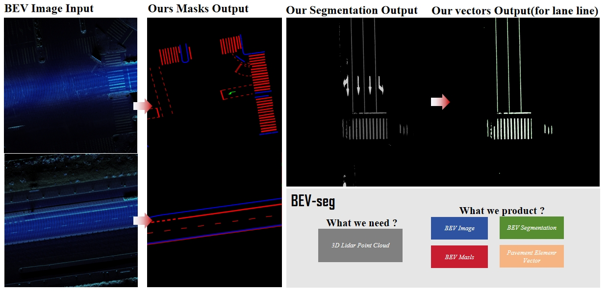

# BEV_Seg:A method for converting 3D radar point clouds into BEV views and automating road vector feature annotation
*Chao He*

## Application
Using geojson annotation data to create datasets and converting lidar data into BEV (bird's-eye view) for segmenting 2D road surface markings such as lane lines and arrows, achieving automated annotation.

